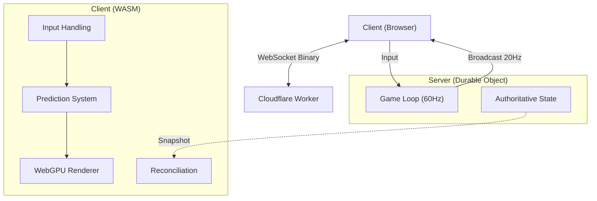

# Architecture Guide

This document explains the high-level design of Pongo, how the pieces fit together, and provides links to the code for deep dives.

## System Overview

Pongo is a real-time multiplayer game built on a shared-code architecture. The core game logic is written in Rust and compiled to WebAssembly (WASM) for both the client (browser) and server (Cloudflare Durable Objects).

### High-Level Diagram

## Codebase Map

The project is structured as a Cargo workspace with shared crates.

| Crate | Path | Description | Key Files |
|-------|------|-------------|-----------|
| **game_core** | [`game_core/`](game_core/) | **The Heart.** Shared ECS logic, physics, and config. | [`lib.rs`](game_core/src/lib.rs) (step function) [`config.rs`](game_core/src/config.rs) (constants) |
| **client_wasm** | [`client_wasm/`](client_wasm/) | **The Frontend.** Prediction, interpolation, and rendering. | [`lib.rs`](client_wasm/src/lib.rs) (entry) [`renderer/`](client_wasm/src/renderer) (WebGPU) |
| **server_do** | [`server_do/`](server_do/) | **The Backend.** Durable Object implementation. | [`game_state.rs`](server_do/src/game_state.rs) (server logic) |
| **proto** | [`proto/`](proto/) | **The Glue.** Network messages and serialization. | [`lib.rs`](proto/src/lib.rs) (structs) |

---

## How It Works

### 1. The Game Loop (`game_core`)

The simulation is deterministic and frame-independent. It uses a fixed timestep (60Hz) with an accumulator to ensure physics consistency across different frame rates.

- **Entry Point:** [`step`](game_core/src/lib.rs#L19)
- **Physics:** [`systems/movement.rs`](game_core/src/systems/movement.rs) handles movement, [`systems/collision.rs`](game_core/src/systems/collision.rs) handles bounces.
- **ECS:** We use [hecs](https://docs.rs/hecs) for entity management.

### 2. The Server (`server_do`)

Each game match runs in a Cloudflare **Durable Object** (DO). The DO maintains the authoritative state and runs the `step` function 60 times a second.

- **Tick Loop:** The server calls [`GameState::step`](server_do/src/game_state.rs#L189) which delegates to `game_core::step`.
- **Broadcasting:** Every 3rd tick (20Hz), it sends a snapshot to all clients via [`broadcast_state`](server_do/src/game_state.rs#L271).

### 3. The Client (`client_wasm`)

The client needs to be smooth (120Hz+) even though headers only arrive at 20Hz.

- **Prediction:** The [`ClientPredictor`](client_wasm/src/prediction.rs) applies local inputs immediately so the player feels zero latency.
- **Reconciliation:** When a server snapshot arrives, if it disagrees with the local prediction, we rollback and replay inputs.
- **Rendering:** [`Renderer`](client_wasm/src/renderer/mod.rs) uses WebGPU to draw the state. It interpolates remote entities (opponent paddle, ball) for smoothness.

### 4. Networking (`proto`)

We use [postcard](https://github.com/jamesmunns/postcard) for efficient binary serialization over WebSockets.

- **C2S (Client to Server):** Input, Join, Ping.
- **S2C (Server to Client):** GameState, Welcome, GameOver.
- **Definitions:** See [`proto/src/lib.rs`](proto/src/lib.rs).

---

## Key Data Flows

### Input Handling
1. Browser captures key press in [`on_key_down`](client_wasm/src/lib.rs).
2. Client updates local paddle immediately.
3. Client sends `C2S::Input` to server.
4. Server applies input in its next tick.
5. Server includes new paddle position in next broadcast.

### Rendering Frame
1. `requestAnimationFrame` calls [`render`](client_wasm/src/lib.rs).
2. Prediction system updates local game state.
3. [`Renderer::draw`](client_wasm/src/renderer/mod.rs) submits draw commands to GPU.
