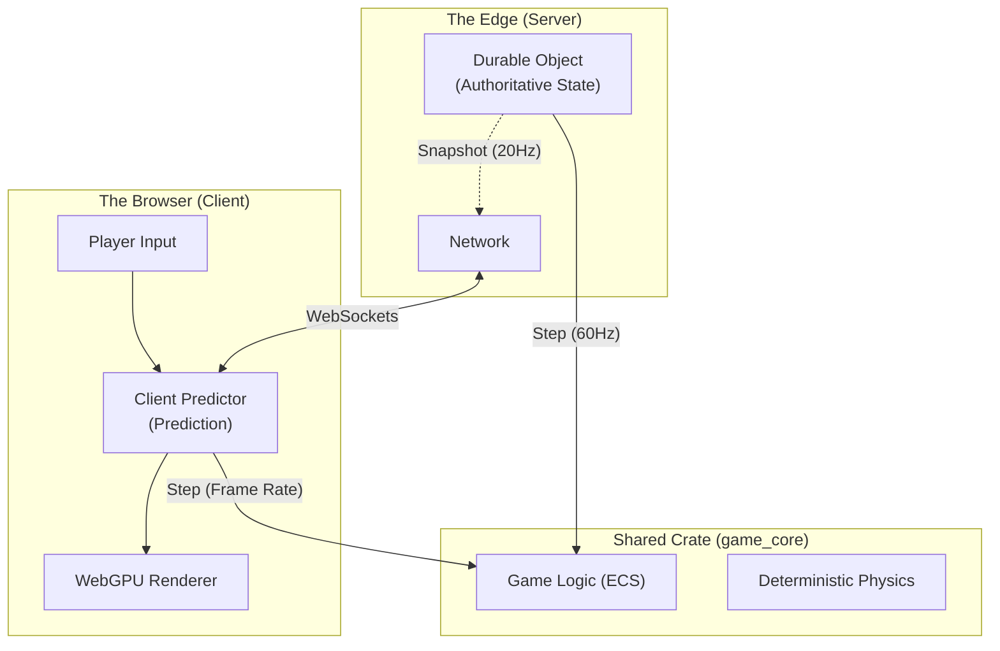
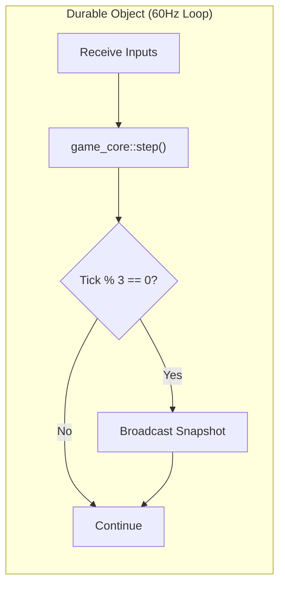
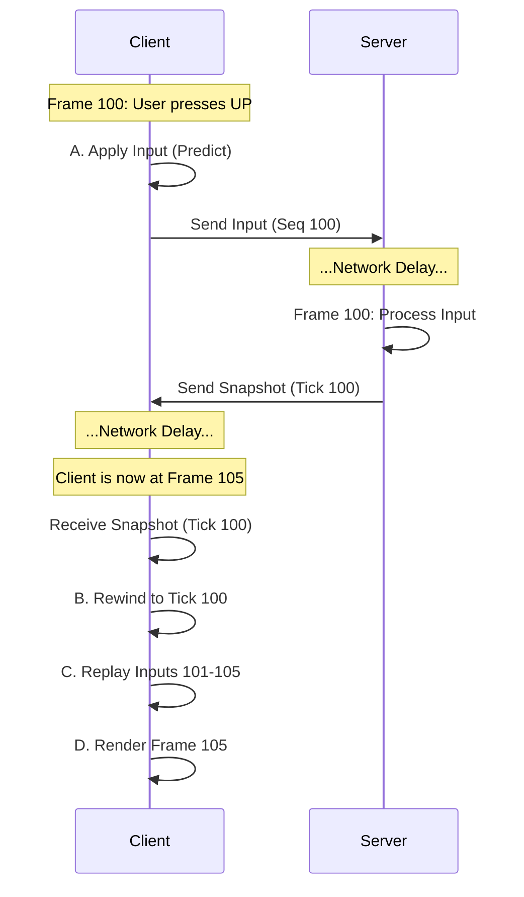

# How I Built a Low-Latency Multiplayer Game with Rust, WebAssembly, and Cloudflare Durable Objects

> *Building a real-time multiplayer game involves trade-offs between infrastructure complexity, cost, and latency. This article explores one approach: using Rust compiled to WebAssembly to share game logic between the browser and Cloudflare's edge network.*

**[Play the live demo →](https://pongo.tre.systems/)** | **[View source on GitHub →](https://github.com/rgilks/pongo)**

---

## Why Pong?

In 1972, Atari released *Pong*, effectively launching the video game industry. Today, it serves as an excellent case study for multiplayer networking.

Why? Because it demands precision.

In many modern games, small amounts of latency can be masked by animation or game design. But in Pong, the physics are simple and transparent. The ball moves quickly, and if your paddle isn't exactly where you expect it to be, the experience suffers immediately.

It requires:
1.  **Precise movement**: High-frequency input sampling.
2.  **Instant feedback**: Minimal perceived latency.
3.  **State validation**: Preventing state divergence between client and server.

If I can solve these problems for a browser-based Pong using serverless infrastructure, the same patterns apply to more complex games.

## The Architecture: One Codebase, Two Worlds

When building **Pongo**, a recreation of this classic, the goal was to explore a specific technical challenge: **How can we deliver a smooth, 60FPS experience while maintaining a secure, authoritative server?**

The answer lay in a "Universal App" architecture powered by **[Rust](https://www.rust-lang.org/)**, **[WebAssembly (WASM)](https://webassembly.org/)**, and **[Cloudflare Durable Objects](https://developers.cloudflare.com/durable-objects/)**.

Most multiplayer games strive to share code between client and server, but language barriers often get in the way. By writing the core logic in Rust, I can compile it to WebAssembly to run in two very different places:
1.  **The Browser**: Rendering at 120Hz+ with WebGPU.
2.  **The Edge**: Running in a Cloudflare Durable Object at 60Hz.



## 1. The Shared Core (`game_core`)

A key component is the `game_core` crate. It uses [`hecs`](https://docs.rs/hecs), a lightweight Entity Component System (ECS), to manage game entities like paddles and the ball. The physics simulation runs in a deterministic `step` function — because it uses predictable logic (via [`glam`](https://docs.rs/glam) for math and fixed timesteps), it produces consistent results on both the client (WASM) and the server.

Here is the actual step function that runs on both sides:

```rust
// game_core/src/lib.rs

pub fn step(
    world: &mut World,
    time: &mut Time,
    map: &GameMap,
    config: &Config,
    /* ... */
) {
    // Fixed timestep loop for determinism
    let mut remaining_dt = time.dt.min(Params::MAX_DT);
    while remaining_dt > 0.0 {
        let step_dt = remaining_dt.min(Params::FIXED_DT); // 1/60 sec
        remaining_dt -= step_dt;

        // 1. Move paddles based on accumulated inputs
        systems::movement::move_paddles(world, map, config, step_dt);

        // 2. Physics & Collisions
        move_ball(world, step_dt);
        check_collisions(world, map, config, events);
    }
}
```

This functions strictly as a pure simulation: Input State + World State = New World State.

## 2. Server: Authority at the Edge

The server uses **[Cloudflare Durable Objects](https://developers.cloudflare.com/durable-objects/)** to host individual matches. A Durable Object (DO) is a unique, single-threaded instance that can hold state in memory and run a loop.

This is critical. Unlike stateless serverless functions, a DO can run a **Game Loop**.



The server calls `game_core::step()` on every tick (~60Hz), but only broadcasts state snapshots every 3rd frame (~20Hz) to conserve bandwidth.

The server is the "Authority". If the client thinks the ball is at `x=100` but the server says `x=102`, the server wins. But waiting for the server takes time (RTT).

## 3. Client: Prediction and Reconciliation

To mitigate the effects of latency, the client implements **Client-Side Prediction**.

When you press "UP", the client applies the input *immediately* and renders the frame. It doesn't wait for round-trip confirmation from the server. This makes the game feel responsive.

### The Reconciliation Loop

However, the client is just guessing. When the authoritative snapshot arrives from the server (usually ~50ms old), the client must check if its guess was correct.



If the prediction matches the server (which is typical given shared deterministic logic), the user sees smooth movement. If there is a divergence (e.g. due to packet loss), the client resets to the authoritative server state.

## 4. Rendering with WebGPU

The client uses [`wgpu`](https://wgpu.rs/), the Rust implementation of the WebGPU standard, for rendering. WebGPU is the successor to WebGL, offering better performance and a more modern API.

Because the game logic runs at 60Hz but displays can refresh at 120Hz or higher, the renderer interpolates entity positions between physics ticks to ensure smooth visuals.

## 5. Efficient Serialization with `postcard`

Network bandwidth matters. The project uses [`postcard`](https://docs.rs/postcard), a `#![no_std]`-compatible binary serialization format, for all WebSocket messages. It produces significantly smaller payloads than JSON, reducing both latency and cost.

## Economics & Limitations: Is it actually free?

The "serverless" promise is pay-per-use, but real-time games are chatty. Let's crunch the numbers for 2024.

### The Cost of Real-Time
Cloudflare charges for **Requests** and **Duration** (GB-s).
-   **Requests**: Every WebSocket message sent counts as a request (on the standard Workers plan, though specific DO pricing treats active WebSocket connections differently).
-   **Duration**: You are billed for the time the Durable Object is "active" (processing code).

**Free Tier vs. Paid ($5/mo):**
-   **Free Tier**: 100k requests/day. At 60Hz input (approx. 3,600 req/min/player), this only supports ~30 minutes of total gameplay per day. Perfect for development, but not production.
-   **Paid Tier ($5/mo)**: Checks in at **10 million requests/month**. This lifts the ceiling dramatically, allowing for roughly **50 hours of active gameplay per month** included in the base price, with cheap overage.

**Optimization is still Key**: Even with the paid plan, naive networking burns money. I optimized by sending inputs only when they change and broadcasting server snapshots at a reduced rate (20Hz).

### The Problem with scaling
Durable Objects are single-region. If a match is hosted in London, a player in Tokyo effectively faces a 200ms+ RTT.
-   **Solution**: Matchmaking. You should group players by region and spawn the Durable Object in the data center closest to them.
-   **Limit**: You cannot move a running Durable Object to another region.

## Conclusion

By leveraging Rust's ability to target Wasm, Pongo achieves a "best of both worlds" result:
1.  **Low Latency**: The client predicts frame-perfect input.
2.  **High Security**: The server has final authority, preventing cheating.
3.  **Low Cost**: Running game loops on the Edge (Durable Objects) allows for scalable infrastructure without managing fleet servers.

This architecture proves that you don't need a massive dedicated server fleet to build a responsive multiplayer game in 2024.

## A Note on AI-Assisted Development

This project was built using [Google Antigravity](https://antigravity.google/) with multiple AI models:

-   **Claude Opus 4 (Thinking)**: Used for complex architectural decisions and debugging subtle issues like MCTS AI logic and prediction/reconciliation edge cases.
-   **Gemini 2.5 Pro**: Used for substantial refactoring, implementing new features, and detailed code reviews.
-   **Gemini 2.5 Flash**: Used for quick iterations, formatting, linting fixes, and routine changes.

The combination proved effective: slower "thinking" models for problems requiring deep reasoning, faster models for high-volume changes.
