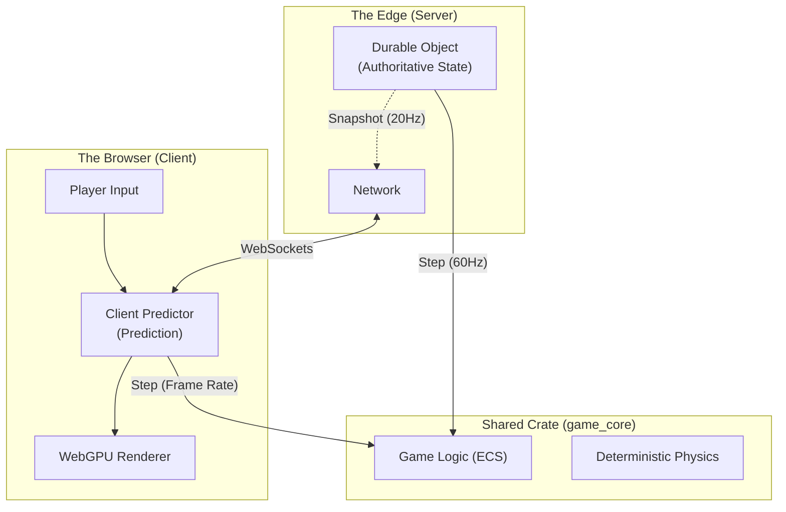
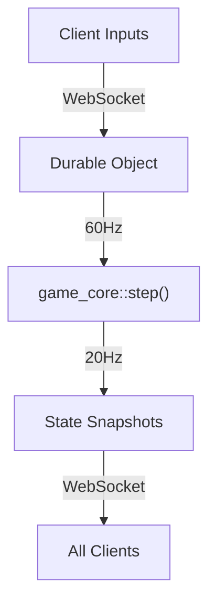
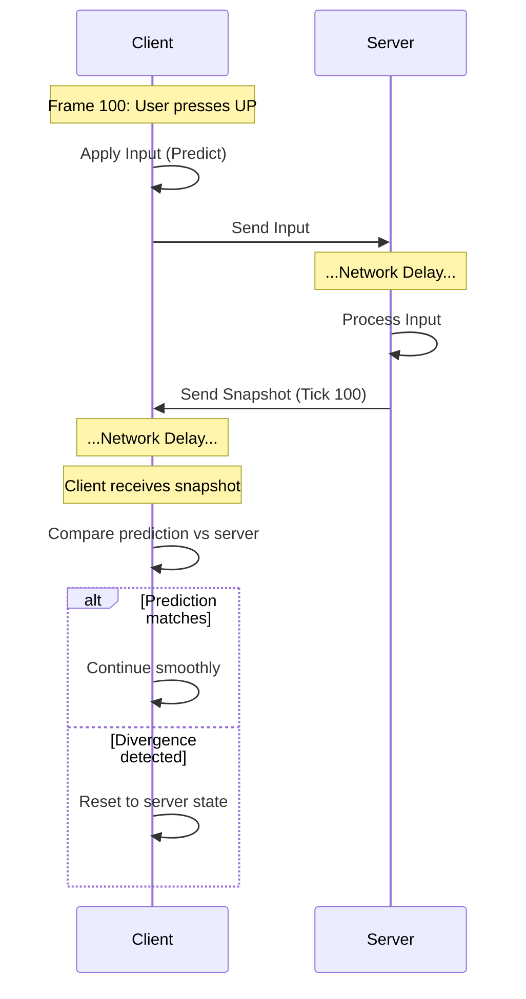

# How I Built a Real-Time Multiplayer Game on the Edge with Rust and WebAssembly

> *Real-time multiplayer games are mostly about trade-offs: latency vs authority, simplicity vs correctness, and cost vs control. This article walks through an approach that worked well for me — using Rust compiled to WebAssembly to share deterministic game logic between the browser and Cloudflare’s edge.*

**[Play the live demo →](https://pongo.tre.systems/)** | **[View source on GitHub →](https://github.com/rgilks/pongo)**

---

## Why Pong?

In 1972, Atari released *Pong*, effectively kicking off the video game industry. More than fifty years later, it turns out to be a great test case for multiplayer networking.

In many modern games, latency can be masked with animation, camera tricks, or generous hitboxes. Pong gives you none of that. The physics are simple, the ball is fast, and if your paddle isn’t exactly where you expect it to be, you feel it immediately.

It demands:
1. **Precise movement** — high-frequency input sampling.
2. **Instant feedback** — minimal perceived latency.
3. **State validation** — preventing the client and server from drifting apart.

If I can make this work for a browser-based Pong running entirely on serverless infrastructure, the same patterns apply to much more complex games.

---

## The Architecture: One Codebase, Two Worlds

When building **Pongo**, my goal wasn’t just to recreate a classic — it was to explore a very specific question:

**How do you deliver a smooth 60FPS experience while still keeping a secure, authoritative server?**

The solution I landed on was a kind of “universal app” architecture, built with **Rust**, **WebAssembly (WASM)**, and **Cloudflare Durable Objects**.

Most multiplayer games try to share logic between client and server, but language boundaries usually get in the way. By writing the core game logic in Rust, I can compile it to WebAssembly and run the *same code* in two very different environments:

1. **The Browser** — rendering at 120Hz+ with WebGPU.
2. **The Edge** — running inside a Cloudflare Durable Object at a fixed 60Hz.



---

## 1. The Shared Core (`game_core`)

At the heart of the project is the `game_core` crate. It uses [`hecs`](https://docs.rs/hecs), a lightweight Entity Component System (ECS), to manage entities like paddles and the ball.

The physics simulation lives in a deterministic `step` function. It uses fixed timesteps and predictable math (via [`glam`](https://docs.rs/glam)) so that, given the same inputs, it produces the same results on both the client (WASM) and the server.

Here’s the actual `step` function that runs in both environments:

```rust
// game_core/src/lib.rs

pub fn step(
    world: &mut World,
    time: &mut Time,
    map: &GameMap,
    config: &Config,
    /* ... */
) {
    // Fixed timestep loop for determinism
    let mut remaining_dt = time.dt.min(Params::MAX_DT);
    while remaining_dt > 0.0 {
        let step_dt = remaining_dt.min(Params::FIXED_DT); // 1/60 sec
        remaining_dt -= step_dt;

        // 1. Move paddles based on accumulated inputs
        systems::movement::move_paddles(world, map, config, step_dt);

        // 2. Physics & Collisions
        move_ball(world, step_dt);
        check_collisions(world, map, config, events);
    }
}
```

This is deliberately boring code.  
Input state + world state goes in, a new world state comes out.

---

## 2. Server: Authority at the Edge

Each match runs inside a **Cloudflare Durable Object**. A Durable Object is a single-threaded instance that can hold in-memory state and, crucially, run a continuous loop.

This is the key difference from typical stateless serverless functions: a Durable Object can host a proper **game loop**.



The server advances the simulation at ~60Hz but only broadcasts authoritative snapshots every third tick (~20Hz) to keep bandwidth and costs under control.

The server is the authority.  
If the client thinks the ball is at `x = 100` but the server says `x = 102`, the server wins. Always.

---

## 3. Client: Prediction and Reconciliation

To hide round-trip latency, the client uses **client-side prediction**.

When you press “UP”, the client applies that input immediately and renders the next frame. It doesn’t wait for confirmation from the server. This is what makes the game feel responsive.

### The Reconciliation Loop

The client is still guessing, though. When an authoritative snapshot arrives from the server (usually ~50ms old), the client checks whether its prediction was correct.



---

## 4. Rendering with WebGPU

Rendering is handled with [`wgpu`](https://wgpu.rs/), Rust’s implementation of the WebGPU standard. The simulation runs at 60Hz, but displays often refresh at 120Hz or higher, so the renderer interpolates entity positions between physics ticks to keep visuals smooth.

---

## 5. Efficient Serialization with `postcard`

All WebSocket messages are serialized using [`postcard`](https://docs.rs/postcard), a compact binary format that produces far smaller payloads than JSON. This reduces latency and keeps request counts (and costs) under control.

---

## Economics & Limitations: Is this actually free?

“Serverless” sounds cheap until you start sending messages 60 times a second.

Cloudflare bills Durable Objects based on **requests** and **execution time (GB-s)**.

- **Free tier**: ~30 minutes of total gameplay per day.
- **Paid plan ($5/month)**: ~50 hours of active gameplay per month before overages.

Durable Objects are also single-region, which means global latency must be handled explicitly with region-aware matchmaking.

---

## Conclusion

By leaning on Rust’s ability to target WebAssembly, Pongo ends up with a clean and pragmatic architecture:

1. **Low latency** through client-side prediction.
2. **Strong authority** via deterministic server simulation.
3. **Low operational overhead** by running game loops at the edge.

You don’t need a traditional fleet of dedicated servers to build a responsive multiplayer game in 2024 — but you do need to be deliberate about determinism, networking, and cost.

---

## A Note on AI-Assisted Development

This project was built with heavy AI assistance — but not in a “one prompt and done” way.

I used Google Antigravity with multiple models, picking slower, reasoning-heavy models for hard problems and faster models for iteration, refactoring, and routine cleanup. That division of labour turned out to be a very effective workflow.
