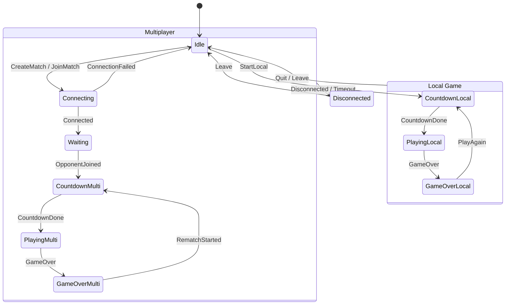

# State Machine Implementation Review

## Overview

The game uses a hybrid State Machine architecture where the **logic** (valid transitions, state definitions) is defined in Rust (compiled to WASM), while the **side effects** (UI updates, DOM manipulation, Network I/O) are handled in JavaScript.

**Core Files:**

- **Logic**: `client_wasm/src/fsm.rs` (The Brain)
- **Binder**: `client_wasm/src/lib.rs` (Exports FSM to JS)
- **Driver**: `lobby_worker/script.js` (The Hands)

## Current Architecture

### The Rust FSM (`GameFsm`)

The `GameFsm` struct in Rust is a pure Finite State Machine. It holds the current state (`FsmState` enum) and defines valid transitions via `get_next_state`. It does **not** hold game data (scores, positions) or side effects.

**Key Characteristics:**

- **Stateless Logic**: Pure functions determine if `State A + Action -> State B` is valid.
- **WASM Exposed**: Methods like `transition_str` allow JS to drive it using string actions.
- **Testable**: Fully unit-tested in Rust.

### The JavaScript Driver (`script.js`)

The JS side wraps the WASM FSM instance. It intercepts transitions to perform async side effects (entering/exiting states).

**FSM Wrapper Pattern:**

```javascript
const FSM = {
  async transition(action) {
    // 1. Validate & Update Rust State (Synchronous)
    const result = rustFsm.transition_str(action);
    if (!result.success) return false;

    // 2. Perform Side Effects (Async)
    await this.exitState(prevState);
    await this.enterState(rustFsm.state);
    return true;
  },
};
```

## State Flow Diagram



## Analysis

### ✅ Strengths

1.  **Single Source of Truth**: The Rust FSM prevents invalid states (e.g., you can't go from `Idle` to `GameOver` directly).
2.  **Platform Agnostic Logic**: The FSM logic allows the game flow to be tested without a browser environment.
3.  **Clean Separation**: Rust handles "What is allowed", JS handles "What happens".

### ⚠️ Critical Issues

1.  **Async Race Conditions**:
    The JS `transition` function awaits `exitState` and `enterState`. Since `rustFsm` updates _immediately_ but side effects are _async_, a rapid sequence of events can cause desynchronization.
    - _Scenario_: `State A` -> `State B`. Rust updates to B. `exitState(A)` begins.
    - _Interrupt_: New event triggers `State B` -> `State C`. Rust updates to C.
    - _Race_: `enterState(C)` might run before or during `enterState(B)`, causing UI glitches or broken game loops.

2.  **Usage Disconnect**:
    `client_wasm/src/lib.rs` exports the FSM but **never uses it internaly**. The `Client` struct has no knowledge of the FSM state. This means the simulation loop relies on presence checks (`local_game.is_some()`) rather than explicit state checks.

### ❌ Missing Features

1.  **Pause State**: No mechanism to pause local games.
2.  **Reconnection Strategy**: Network failures drop immediately to `Disconnected`. A `Reconnecting` state with a grace period would improve UX.
3.  **Input Locking**: Inputs aren't explicitly locked during transitions, relying on UI hiding/disabling.

## Recommendations

### 1. Fix Async Race Conditions (High Priority)

Implement a "Transition Lock" in the JS FSM wrapper to queue or reject transitions while one is in progress.

```javascript
const FSM = {
  isTransitioning: false,
  async transition(action) {
    if (this.isTransitioning) {
      console.warn("Transition locked:", action);
      return false;
    }
    this.isTransitioning = true;
    try {
      // ... perform transition
    } finally {
      this.isTransitioning = false;
    }
  },
};
```

### 2. Standardize State in Rust

Consider passing the `FsmState` into the `Client` struct in `lib.rs`. This would allow the pure Rust simulation to behave differently based on state (e.g., auto-pause if not in `Playing` state) rather than inferring it.

### 3. Add Missing States

- **Paused**: For local play.
- **Reconnecting**: To handle temporary packet loss without killing the match.

### 4. Code Cleanup

The double definition of `GameState` constants in JS (mapping `FsmState.Idle` to `GameState.IDLE`) is redundant if valid exports exist. Direct usage of `FsmState` in JS would be cleaner.
